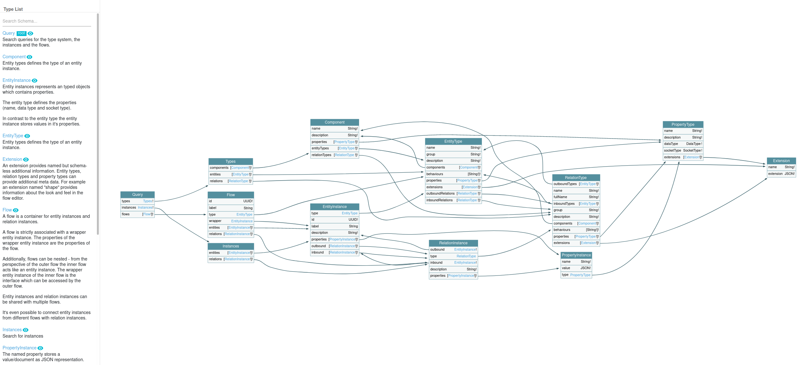
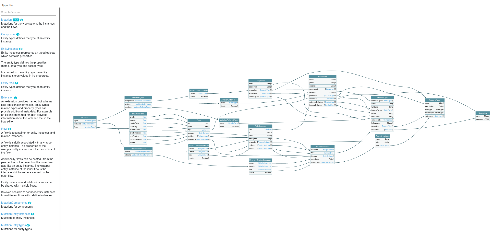

# GraphQL API

GraphQL is the most important interface for interaction with the Reactive Graph Flow.

## What is GraphQL?

GraphQL stands for "Graph Query Language". It is a query language with which data present in graphs can be efficiently
queried and selectively modified.

## Why do we use GraphQL?

As already described, Inexor uses a graph to hold the highly interconnected data of the Entity Component System. A query
language like GraphQL allows navigating on this graph. For example, it is possible to navigate from an entity instance
to its entity type. It is best described by the three graphics that show the possibilities available through the GraphQL
interface.

GraphQL was chosen as the query language because it is independent of a specific programming language and because it can
be used across technologies.

GraphQL also supports subscribing to change to data. This is also the case, for example, in the reactive property
instances. It is possible to subscribe to a property of an entity instance via GraphQL and get changes to this property
in real time.

Other advantages of GraphQL are type safety and the fact that semantics can be mapped better.

### Queries

### Mutations

### Subscriptions

## GraphQL Endpoint

The GraphQL endpoint can be reached at `http://hostname/31415/graphql` or `ws://hostname/31415/graphql`.

The GraphQL schema is well documented.

### Schema Introspection

The GraphQL Server allows introspection and returns a GraphQL schema including documentation. With this it is possible
to validate queries and mutations and some tools can use the schema to provide autocompletion for creating queries.

## GraphQL Tools

* [Altair](https://altair.sirmuel.design/)
* [GraphQL Voyager](https://apis.guru/graphql-voyager/)
* https://addons.mozilla.org/de/firefox/addon/graphql-developer-tools/
